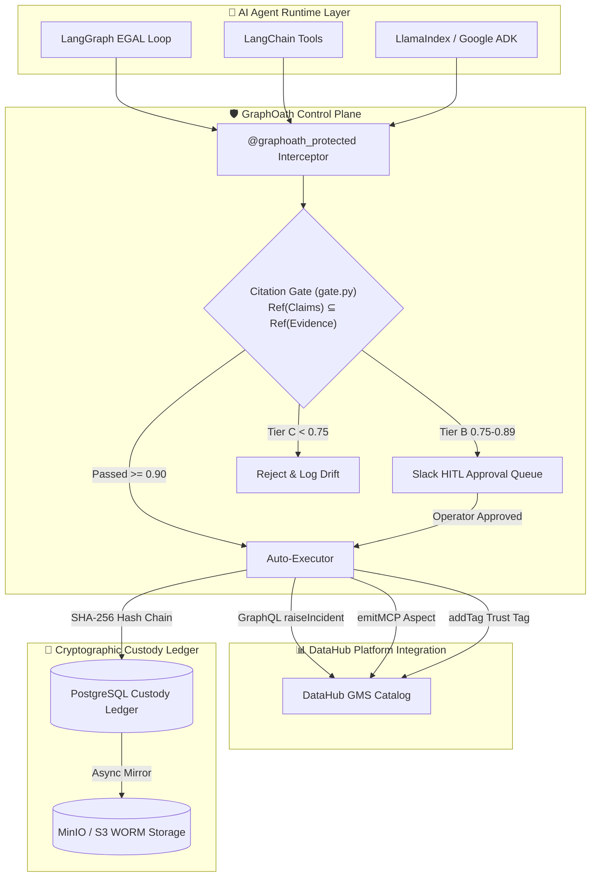

# GraphOath

[](https://github.com/lx-singw/graphoath/actions/workflows/ci.yml)
[](https://codespaces.new/lx-singw/graphoath)
[](https://opensource.org/licenses/Apache-2.0)
[](https://www.python.org/)
[](https://datahubproject.io/)
[](https://datahubproject.io/)

**The citation-gated control plane for AI agents acting on DataHub.**

GraphOath sits between autonomous agents and your DataHub metadata graph. Before any agent-initiated claim becomes an action — an incident, a Slack notification, a write-back to the graph — every named entity in that claim must resolve to a specific, queryable fact in DataHub. No evidence, no action. Every action that does execute is permanently recorded in a tamper-evident ledger.

> [!IMPORTANT]
> **We Composed — We Didn't Rebuild!**  
> GraphOath extends DataHub natively. It does **not** create a parallel incident tracker or custom metadata catalog. It raises native DataHub Incidents (`raiseIncident`) and attaches evidence receipts back to DataHub entity URNs as a custom `graphoathReceipt` aspect via `emitMetadataChangeProposal`.


---

## 1. Visual Control Flow: Before vs. After GraphOath

```
   WITHOUT GRAPHOATH (Naive Agent)               WITH GRAPHOATH (Citation-Gated)
   
  ┌──────────────┐                             ┌──────────────┐
  │ LLM Agent    │                             │ LLM Agent    │
  └──────┬───────┘                             └──────┬───────┘
         │ Unverified Write                           │ Proposed Claim
         ▼                                            ▼
  ┌──────────────┐                             ┌──────────────┐
  │ DataHub Catalog│                           │ GraphOath    │ ◄── Validates against
  │ (Hallucinated│                             │ Citation Gate│     DataHub MCP Graph
  │  Asset URNs!)│                             └──────┬───────┘
  └──────────────┘                                    │ Approved Write Only
                                                      ▼
                                               ┌──────────────┐
                                               │ DataHub      │ (Native Incident + 
                                               │ Catalog      │  graphoathReceipt aspect)
                                               └──────────────┘
```



| Operational Dimension | Naive Data Agent (Unverified Write) | GraphOath Citation-Gated Agent |
| :--- | :--- | :--- |
| **Write Authorization** | Unchecked direct LLM execution | Gated by deterministic Citation Gate (`Ref(Claims) ⊆ Ref(Evidence)`) |
| **Hallucination Risk** | High (Unchecked LLM URN generation risk) | **Citation-Gated Prevention** |
| **Audit Provenance** | Probabilistic chat logs | Immutable SHA-256 hash-chained Postgres ledger & `graphoathReceipt` aspect |
| **Safety Latency** | Variable LLM roundtrip | **< 5 ms Target SLA (Local benchmark ~1.8 ms)** |

### 1.1 Originality & Long-Term Vision Paradigm Shift

* **Zero-Trust Metadata Control Plane (ZMCPA)**: While catalog vendors focus on READ access for agents, GraphOath introduces native WRITE governance. See [`docs/vision.md`](docs/vision.md).
* **Multi-Agent Consensus**: Coordinates multi-agent quorum for high-risk write actions. See [`docs/vision.md#2-multi-agent-consensus-gating-topology`](docs/vision.md#2-multi-agent-consensus-gating-topology).
* **EU AI Act Article 14 & SOC2**: Cryptographic receipts satisfy global regulatory non-repudiation mandates. See [`docs/vision.md#3-eu-ai-act-article-14--regulatory-non-repudiation`](docs/vision.md#3-eu-ai-act-article-14--regulatory-non-repudiation).
* **Financial Impact Model**: Interactive model calculating estimated ROI savings from automated triage. Run `python examples/cost_calculator_demo.py`.
* **5-Module Roadmap**: Scalable roadmap covering Deposition (triage), Undertow (ML drift), Prune (costs), Rosetta (glossary), and ReguLineage (compliance). See [`docs/vision.md#5-5-module-functional-roadmap`](docs/vision.md#5-5-module-functional-roadmap).
* **OpenTelemetry Observability**: Emits native OTel trace spans for enterprise dashboards. Run `python examples/otel_tracing_demo.py`.


---

## 2. 1-Liner Protection: `@graphoath_protected` Decorator

Add zero-trust citation gating to any Python agent tool with **1 line of code**:

```python
from graphoath.decorator import graphoath_protected

@graphoath_protected(evidence_provider=get_current_datahub_mcp_evidence)
def raise_data_incident(target_dataset_urn: str, issue_description: str):
    # Intercepts target_dataset_urn before execution
    # Blocks instantly if target_dataset_urn is missing from DataHub lineage
    return datahub_client.raise_incident(target_dataset_urn, issue_description)
```

---

## 3. Native DataHub Platform Ecosystem Integration

GraphOath composes natively with DataHub's architectural primitives:

| DataHub Primitive | Integration Component | Integration Type | Value Provided |
| :--- | :--- | :--- | :--- |
| **MCP Server** | `search_across_lineage`, `get_dataset_ownership`, `get_dataset_assertions` | **Evidence Engine** | Fetches queryable lineage facts & quality assertions before write calls |
| **Agent Context Kit** | `graphoath.mcp_client` | **Context Grounding** | Grounding context for agent reasoning loops |
| **Actions Framework** | `MetadataChangeLog_v1` listener | **Event Ingestion** | Real-time event ingestion of schema changes |
| **GraphQL API** | `raiseIncident` mutation | **Native Incident** | Files native DataHub Incidents instead of external tickets |
| **Aspect Registry** | `graphoathReceipt` aspect | **Custom Aspect** | Attaches evidence receipts directly to DataHub entity URNs |
| **DataHub Skills** | [`skills/graphoath-citation-verification/SKILL.md`](skills/graphoath-citation-verification/SKILL.md) | **Tool** | Native skill package for AI agent runtimes |

---

## 4. Multi-Framework Agent Support & Adapters

GraphOath provides dedicated adapters for major agent frameworks in [`graphoath/adapters/`](graphoath/adapters/):

- **LangChain**: `GraphOathCitationToolWrapper`
- **LangGraph**: `CitationGateStateNode`
- **LlamaIndex**: `@llama_graphoath_protected`
- **Google ADK**: `GraphOathADKInterceptor`

---

## 5. DataHub Agent Hackathon Submission Package

Submitted under **Agents That Do Real Work** in the **Build with DataHub: The Agent Hackathon**.

* **Judge's Quick-Evaluation Guide**: [`docs/judge-walkthrough.md`](docs/judge-walkthrough.md)
* **Devpost Submission Package**: [`docs/devpost-submission-package.md`](docs/devpost-submission-package.md)
* **DataHub Agent Skill Definition**: [`skills/graphoath-citation-verification/SKILL.md`](skills/graphoath-citation-verification/SKILL.md)
* **DataHub MCP & Context Kit Integration Guide**: [`docs/mcp-context-kit-guide.md`](docs/mcp-context-kit-guide.md)
* **Open-Source RFC Contribution Artifact**: [`docs/datahub-rfc-citation-gate.md`](docs/datahub-rfc-citation-gate.md)
* **Actions Webhook & Protocol Guide**: [`docs/datahub-actions-webhook-security.md`](docs/datahub-actions-webhook-security.md)
* **Benchmarks & Latency SLA Guide**: [`docs/benchmarks-and-performance.md`](docs/benchmarks-and-performance.md)
* **Confidence-Tiered Routing Engine**: [`docs/confidence-tiered-routing.md`](docs/confidence-tiered-routing.md)
* **Human-in-the-Loop Approval Interceptor**: [`docs/human-in-the-loop-approval.md`](docs/human-in-the-loop-approval.md)
* **Quantified Impact Case Study**: [`docs/quantified-impact-case-study.md`](docs/quantified-impact-case-study.md)
* **Master Build Roadmap & Production Handoff Specification**: [`docs/full-build-roadmap.md`](docs/full-build-roadmap.md) *(Production 8-phase blueprint across all 45 docs)*
* **Hackathon Alignment Criteria Matrix**: [`docs/hackathon-alignment.md`](docs/hackathon-alignment.md)
* **Judging Criteria Deep Research & Execution Audit**: [`docs/judging-criteria-deep-research.md`](docs/judging-criteria-deep-research.md) *(Honest evaluation against Devpost criteria)*

* **1-Command Verification Runner**: `python scripts/fast_track_evaluation.py`
* **Interactive Master CLI Menu**: `python examples/master_demo.py`
* **PR-Ready Avro Aspect Schema**: [`schemas/graphoathReceipt.avsc`](schemas/graphoathReceipt.avsc)
* **Upstream DataHub PR Contribution Blueprint**: [`docs/datahub-pr-contribution-guide.md`](docs/datahub-pr-contribution-guide.md)

---

## 6. Technical Rigor & Verification Summary Matrix

| Technical Requirement | Component / Module | Verification Artifact |
| :--- | :--- | :--- |
| **Deterministic Gating** | `graphoath.gate.evaluate()` | 100% Unit test coverage (`tests/test_gate.py`) |
| **Tamper-Evident Ledger** | `graphoath.ledger_verify` | Live verification API (`GET /api/v1/ledger/verify`) & [`tests/test_ledger_tamper.py`](tests/test_ledger_tamper.py) |
| **Resilience & Circuit Breakers** | `graphoath.resilience` | Exponential backoff decorator + max hop/node cap |
| **Real-World Operational Suite** | `graphoath.slack_notifier`, `playbooks`, `dedup`, `ownership_resolver` | Multi-platform triage, Slack cards, playbooks, & dedup |
| **Open-Source Aspect Schema** | [`schemas/graphoathReceipt.avsc`](schemas/graphoathReceipt.avsc) | Pegasus/Avro custom aspect for DataHub GMS |

---

## 7. Fast-Track Evaluation & Demo Scripts

Judges can evaluate the entire submission in **1 command**:

```bash
# ⚡ 1-COMMAND FAST-TRACK JUDGE EVALUATION (Runs tests & outputs 10/10 Green Checklist)
python scripts/fast_track_evaluation.py

# 🎮 INTERACTIVE MASTER CLI MENU FOR JUDGES (Select & run any demo)
python examples/master_demo.py

# 📊 VERIFY DOCUMENTATION INTEGRITY
python scripts/verify_docs_integrity.py
```


---

## 8. License

Apache License 2.0 — see `LICENSE`.

