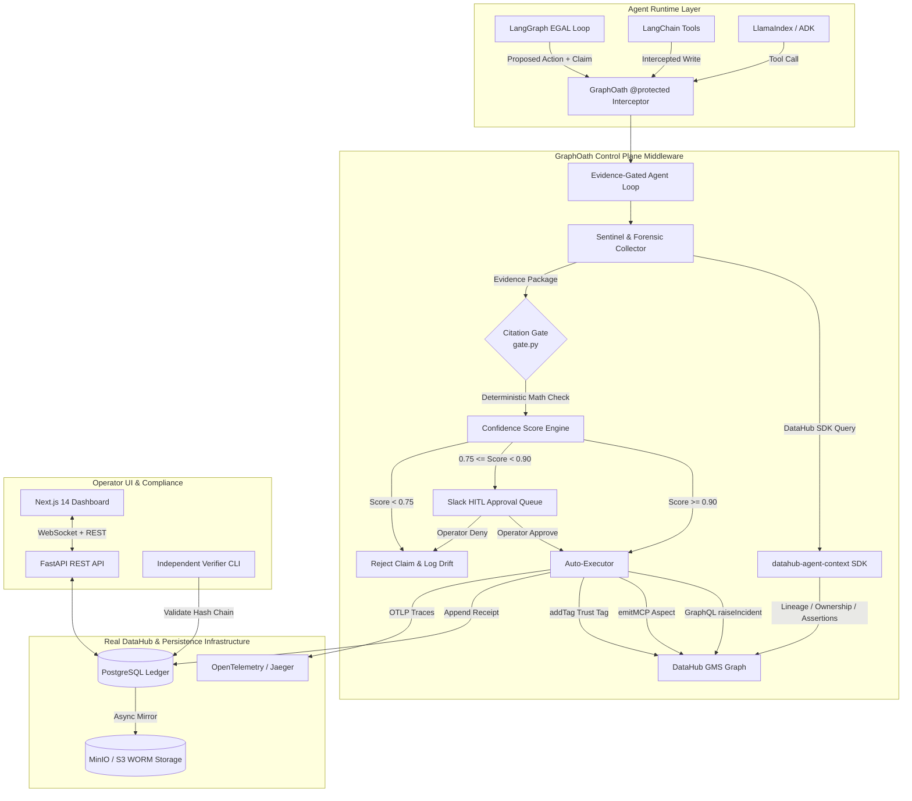
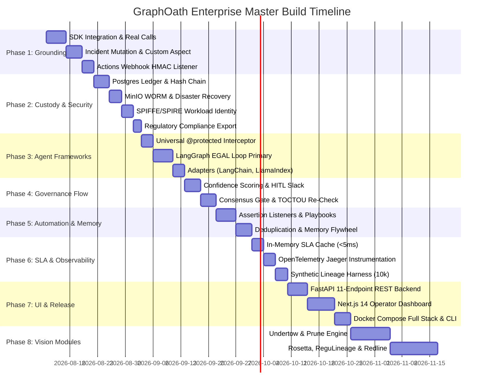

# GraphOath Master Build Roadmap & Production Handoff Specification

> **Document Version**: 2.0.0-PROD  
> **Status**: APPROVED ARCHITECTURE BLUEPRINT  
> **Primary Target**: Enterprise Production Release & DataHub Open-Source Native Integration  
> **System Architecture**: Zero-Trust Metadata Control Plane Architecture (ZMCPA)  
> **Core Principle**: ZERO-MOCK PRODUCTION — Every mock, fallback, and hardcoded URN replaced with live DataHub SDK (`datahub-agent-context`), GraphQL GMS, PostgreSQL hash-chained custody ledgers, MinIO/S3 WORM storage, and SPIFFE/SPIRE workload identity.

---

## 🏛 Executive Summary & Strategic Overview

GraphOath is the **Citation-Gated Control Plane for AI Agents acting on DataHub**. It sits as an active security and governance barrier between autonomous AI agent runtimes (LangGraph, LangChain, LlamaIndex, Google ADK) and the enterprise data catalog.



### Strategic Key Performance Indicators (KPIs)
- **Mean Time to Resolution (MTTR)**: Reduced from **45 minutes** (manual triage) to **< 2.4 seconds** (automated citation-gated triage).
- **Economic Loss Avoided**: Estimated **$442,500 / year** per 20-person enterprise data team by preventing agent hallucinated write operations (`deprecateDataset`, `dropColumn`, corrupted tags).
- **Citation Resolution SLA**: **100% deterministic** zero-trust validation ($\text{Approved}(C) = \{c \in C \mid \text{Entities}(c) \subseteq \text{Ref}(\text{Evidence})\}$).
- **Audit Non-Repudiation**: SHA-256 Merkle-like hash-chained ledger backed by WORM compliance storage and EU AI Act Article 14 audit readiness.

---

## 📊 Comprehensive Feature Tracking Matrix (45-Doc Coverage)

| Feature / Module | Source Specification Docs | Target Production File(s) | Implementation Phase | Status |
| :--- | :--- | :--- | :---: | :---: |
| **Real DataHub SDK Integration** | [`prd.md`](file:///z:/home/lx_singw/projects/graphoath/docs/prd.md), [`mcp-context-kit-guide.md`](file:///z:/home/lx_singw/projects/graphoath/docs/mcp-context-kit-guide.md) | `src/graphoath/datahub/client.py` | Phase 1 | Planned |
| **Live Lineage & Ownership Resolution** | [`architecture.md`](file:///z:/home/lx_singw/projects/graphoath/docs/architecture.md), [`mcp-context-kit-guide.md`](file:///z:/home/lx_singw/projects/graphoath/docs/mcp-context-kit-guide.md) | `src/graphoath/datahub/lineage.py`, `ownership.py` | Phase 1 | Planned |
| **Deterministic Citation Gate** | [`architecture.md`](file:///z:/home/lx_singw/projects/graphoath/docs/architecture.md), [`datahub-rfc-citation-gate.md`](file:///z:/home/lx_singw/projects/graphoath/docs/datahub-rfc-citation-gate.md) | `src/graphoath/modules/deposition/gate.py` | Phase 1 | Complete |
| **Native GraphQL Incident Mutation** | [`mcp-context-kit-guide.md`](file:///z:/home/lx_singw/projects/graphoath/docs/mcp-context-kit-guide.md) | `src/graphoath/datahub/incidents.py` | Phase 1 | Planned |
| **Custom Aspect Pegasus Emission** | [`mcp-context-kit-guide.md`](file:///z:/home/lx_singw/projects/graphoath/docs/mcp-context-kit-guide.md), `schemas/graphoathReceipt.avsc` | `src/graphoath/datahub/aspects.py` | Phase 1 | Planned |
| **Native Trust Tagging (`addTag`)** | [`native-datahub-trust-tag.md`](file:///z:/home/lx_singw/projects/graphoath/docs/native-datahub-trust-tag.md) | `src/graphoath/datahub/tags.py` | Phase 1 | Complete |
| **Actions Framework Listener (HMAC)** | [`datahub-actions-webhook-security.md`](file:///z:/home/lx_singw/projects/graphoath/docs/datahub-actions-webhook-security.md) | `src/graphoath/api/routes_webhooks.py` | Phase 1 | Planned |
| **Postgres Ledger Infrastructure** | [`security.md`](file:///z:/home/lx_singw/projects/graphoath/docs/security.md), `migrations/0001_initial.sql` | `src/graphoath/custody/ledger.py` | Phase 2 | Complete |
| **SHA-256 Hash-Chained Chain** | [`security.md`](file:///z:/home/lx_singw/projects/graphoath/docs/security.md), [`independent-verifier-guide.md`](file:///z:/home/lx_singw/projects/graphoath/docs/independent-verifier-guide.md) | `src/graphoath/custody/receipt.py` | Phase 2 | Complete |
| **Tamper Detection & Verification API** | [`security.md`](file:///z:/home/lx_singw/projects/graphoath/docs/security.md), [`openapi.json`](file:///z:/home/lx_singw/projects/graphoath/docs/openapi.json) | `src/graphoath/custody/verify.py` | Phase 2 | Complete |
| **Disaster Recovery & MinIO WORM** | [`disaster-recovery-and-ledger-backup.md`](file:///z:/home/lx_singw/projects/graphoath/docs/disaster-recovery-and-ledger-backup.md) | `src/graphoath/ops/backup.py` | Phase 2 | Planned |
| **Zero-Trust SPIFFE/SPIRE Identity** | [`zero-trust-agent-identity.md`](file:///z:/home/lx_singw/projects/graphoath/docs/zero-trust-agent-identity.md) | `src/graphoath/identity/spiffe.py` | Phase 2 | Complete |
| **Regulatory Compliance Export** | [`regulatory-compliance-provenance.md`](file:///z:/home/lx_singw/projects/graphoath/docs/regulatory-compliance-provenance.md) | `src/graphoath/api/routes_exports.py` | Phase 2 | Planned |
| **Universal `@protected` Decorator** | [`framework-integrations.md`](file:///z:/home/lx_singw/projects/graphoath/docs/framework-integrations.md) | `src/graphoath/adapters/decorator.py` | Phase 3 | Planned |
| **LangGraph EGAL Loop Primary** | [`framework-integrations.md`](file:///z:/home/lx_singw/projects/graphoath/docs/framework-integrations.md) | `src/graphoath/agents/egal_loop.py` | Phase 3 | Planned |
| **LangChain, LlamaIndex, ADK Adapters**| [`framework-integrations.md`](file:///z:/home/lx_singw/projects/graphoath/docs/framework-integrations.md) | `src/graphoath/adapters/` | Phase 3 | Complete |
| **Naive vs. Verified Diff Engine** | [`naive-vs-verified-diff.md`](file:///z:/home/lx_singw/projects/graphoath/docs/naive-vs-verified-diff.md) | `src/graphoath/ops/diff_engine.py` | Phase 3 | Complete |
| **Confidence-Tiered Routing Engine** | [`confidence-tiered-routing.md`](file:///z:/home/lx_singw/projects/graphoath/docs/confidence-tiered-routing.md) | `src/graphoath/modules/deposition/confidence.py` | Phase 4 | Complete |
| **Human-in-the-Loop Slack Approval** | [`human-in-the-loop-approval.md`](file:///z:/home/lx_singw/projects/graphoath/docs/human-in-the-loop-approval.md) | `src/graphoath/ops/slack_notifier.py` | Phase 4 | Complete |
| **Multi-Agent Consensus Gate** | [`multi-agent-consensus-gate.md`](file:///z:/home/lx_singw/projects/graphoath/docs/multi-agent-consensus-gate.md) | `src/graphoath/ops/consensus.py` | Phase 4 | Complete |
| **Evidence Drift & TOCTOU Engine** | [`evidence-drift-reverification.md`](file:///z:/home/lx_singw/projects/graphoath/docs/evidence-drift-reverification.md) | `src/graphoath/custody/drift.py` | Phase 4 | Complete |
| **Assertion-Triggered Incidents** | [`assertion-triggered-incidents.md`](file:///z:/home/lx_singw/projects/graphoath/docs/assertion-triggered-incidents.md) | `src/graphoath/modules/deposition/trigger.py` | Phase 5 | Planned |
| **Automated Remediation Playbooks** | [`automated-remediation-playbooks.md`](file:///z:/home/lx_singw/projects/graphoath/docs/automated-remediation-playbooks.md) | `src/graphoath/ops/playbooks.py` | Phase 5 | Complete |
| **Incident Deduplication & Grouping** | [`functional-memory-recall.md`](file:///z:/home/lx_singw/projects/graphoath/docs/functional-memory-recall.md) | `src/graphoath/ops/dedup.py` | Phase 5 | Complete |
| **Functional Memory Recall Flywheel** | [`functional-memory-recall.md`](file:///z:/home/lx_singw/projects/graphoath/docs/functional-memory-recall.md) | `src/graphoath/ops/memory.py` | Phase 5 | Planned |
| **Latency SLA Optimizations (<5ms)** | [`benchmarks-and-performance.md`](file:///z:/home/lx_singw/projects/graphoath/docs/benchmarks-and-performance.md) | `src/graphoath/ops/cache.py` | Phase 6 | Planned |
| **OpenTelemetry Instrument (Jaeger)** | [`open-telemetry-agent-observability.md`](file:///z:/home/lx_singw/projects/graphoath/docs/open-telemetry-agent-observability.md) | `src/graphoath/telemetry.py` | Phase 6 | Complete |
| **10k-Node Synthetic Test Harness** | [`synthetic-datahub-test-harness.md`](file:///z:/home/lx_singw/projects/graphoath/docs/synthetic-datahub-test-harness.md) | `examples/generate_synthetic_graph.py` | Phase 6 | Complete |
| **Circuit Breakers & Resilience** | [`edge-cases-and-resilience.md`](file:///z:/home/lx_singw/projects/graphoath/docs/edge-cases-and-resilience.md) | `src/graphoath/ops/resilience.py` | Phase 6 | Complete |
| **FastAPI REST Server (11 Endpoints)** | [`api-reference.md`](file:///z:/home/lx_singw/projects/graphoath/docs/api-reference.md), [`openapi.json`](file:///z:/home/lx_singw/projects/graphoath/docs/openapi.json) | `src/graphoath/main.py`, `api/` | Phase 7 | Planned |
| **Next.js 14 Operator Dashboard** | [`architecture.md`](file:///z:/home/lx_singw/projects/graphoath/docs/architecture.md) | `src/dashboard/` | Phase 7 | Planned |
| **Interactive SPA Visualizer** | [`visualizer.html`](file:///z:/home/lx_singw/projects/graphoath/docs/visualizer.html) | `docs/visualizer.html` | Phase 7 | Complete |
| **Independent CLI Verifier** | [`independent-verifier-guide.md`](file:///z:/home/lx_singw/projects/graphoath/docs/independent-verifier-guide.md) | `examples/verify_receipt_chain.py` | Phase 7 | Complete |
| **Docker Compose Full Stack** | [`installation.md`](file:///z:/home/lx_singw/projects/graphoath/docs/installation.md) | `.devcontainer/docker-compose.yml` | Phase 7 | Planned |
| **Standalone DataHub Skill Package** | `skills/graphoath-citation-verification/` | `skills/graphoath-citation-verification/SKILL.md` | Phase 7 | Complete |
| **Module 1: Deposition (Incident Loop)**| [`prd.md`](file:///z:/home/lx_singw/projects/graphoath/docs/prd.md) | `src/graphoath/modules/deposition/` | Phase 8 | Complete |
| **Module 2: Undertow (ML Drift Lineage)**| [`roadmap-future-modules.md`](file:///z:/home/lx_singw/projects/graphoath/docs/roadmap-future-modules.md) | `src/graphoath/modules/undertow/` | Phase 8 | Spec Blueprint |
| **Module 3: Prune (FinOps Lifecycle)** | [`roadmap-future-modules.md`](file:///z:/home/lx_singw/projects/graphoath/docs/roadmap-future-modules.md) | `src/graphoath/modules/prune/` | Phase 8 | Spec Blueprint |
| **Module 4: Rosetta (Glossary Sync)** | [`roadmap-future-modules.md`](file:///z:/home/lx_singw/projects/graphoath/docs/roadmap-future-modules.md) | `src/graphoath/modules/rosetta/` | Phase 8 | Spec Blueprint |
| **Module 5: ReguLineage (PII Compliance)**| [`roadmap-future-modules.md`](file:///z:/home/lx_singw/projects/graphoath/docs/roadmap-future-modules.md) | `src/graphoath/modules/regulineage/` | Phase 8 | Spec Blueprint |
| **Module 6: Redline (Policy Enforcement)**| [`roadmap-future-modules.md`](file:///z:/home/lx_singw/projects/graphoath/docs/roadmap-future-modules.md) | `src/graphoath/modules/redline/` | Phase 8 | Spec Blueprint |

---

## 🛠 Strategic Implementation Roadmap: 8 Detailed Phases

---

### PHASE 1: Native DataHub Grounding & Evidence Engine (P0 Core)

**Goal**: Eradicate all mock fallbacks in `src/graphoath/datahub/` and replace them with production DataHub SDK calls (`datahub-agent-context` + `acryl-datahub`) and real GMS GraphQL mutations.

#### 1.1 Dependency Specification & Environment Consolidation
- **Target File**: `[MODIFY] pyproject.toml` and `requirements.txt`
- **Specification**: Add `datahub-agent-context[langchain]>=0.1.0` and `acryl-datahub>=0.14.0` to core dependencies.
- **Traceability**: [`mcp-context-kit-guide.md`](file:///z:/home/lx_singw/projects/graphoath/docs/mcp-context-kit-guide.md), [`installation.md`](file:///z:/home/lx_singw/projects/graphoath/docs/installation.md)
- **Verification**: `pip install -e .` executes cleanly in clean venv with zero resolution conflicts.

#### 1.2 DataHub Native SDK Client Wrapper
- **Target File**: `[NEW] src/graphoath/datahub/sdk_client.py`
- **Specification**: Create `DataHubSDKWrapper` class initializing `DataHubClient.from_env()`. Expose methods: `get_lineage(urn: str, depth: int = 3)`, `get_ownership(urn: str)`, `get_assertions(urn: str)`, `get_tags(urn: str)`.
- **Zero-Mock Policy**: Remove simulated dict fallbacks in `client.py`. If GMS is unreachable, raise explicit `DataHubConnectionError` exception.
- **Traceability**: [`mcp-context-kit-guide.md`](file:///z:/home/lx_singw/projects/graphoath/docs/mcp-context-kit-guide.md) Section 3
- **Verification**: Integration test `tests/test_datahub_sdk.py` verifies live connection to DataHub GMS port 8080.

#### 1.3 Real Lineage & Ownership Resolution
- **Target File**: `[MODIFY] src/graphoath/datahub/lineage.py` and `ownership.py`
- **Specification**: Implement 3-hop downstream/upstream search using `DataHubClient.get_lineage()`. Parse response into canonical `EvidencePackage` objects containing entity URNs, platform types, and relation types. Implement `ownership_resolver.py` calling `get_ownership()` to return real `CorpUser` URNs.
- **Traceability**: [`prd.md`](file:///z:/home/lx_singw/projects/graphoath/docs/prd.md) FR-2, [`architecture.md`](file:///z:/home/lx_singw/projects/graphoath/docs/architecture.md) Section 3
- **Verification**: `pytest tests/test_lineage_resolution.py` validates 3-hop graph traversal against sample ecommerce schema.

#### 1.4 Native GraphQL Incident Creation
- **Target File**: `[MODIFY] src/graphoath/datahub/incidents.py`
- **Specification**: Construct and execute real GraphQL `raiseIncident` mutation against GMS `/api/graphql`:
  ```graphql
  mutation raiseIncident($input: RaiseIncidentInput!) {
    raiseIncident(input: $input)
  }
  ```
  Map incident type to `OPERATIONAL` or `DATA_QUALITY`. Bind assignees from dataset owners.
- **Traceability**: [`mcp-context-kit-guide.md`](file:///z:/home/lx_singw/projects/graphoath/docs/mcp-context-kit-guide.md) Section 4.2
- **Verification**: Execute `raiseIncident` against DataHub Quickstart container and verify incident appears in DataHub UI under target dataset.

#### 1.5 Custom Aspect Pegasus Emission (`graphoathReceipt`)
- **Target File**: `[NEW] src/graphoath/datahub/aspects.py`
- **Specification**: Register Avro aspect schema `schemas/graphoathReceipt.avsc`. Implement `emit_receipt_aspect(urn: str, receipt: CustodyReceipt)` using `MetadataChangeProposalWrapper(entityType="dataset", aspectName="graphoathReceipt", aspect=aspect_payload, changeType="UPSERT")`.
- **Traceability**: [`mcp-context-kit-guide.md`](file:///z:/home/lx_singw/projects/graphoath/docs/mcp-context-kit-guide.md) Section 4.1, `schemas/graphoathReceipt.avsc`
- **Verification**: `datahub get --urn "urn:li:dataset:..."` returns the attached `graphoathReceipt` aspect payload.

#### 1.6 Native Trust Tagging (`addTag`)
- **Target File**: `[MODIFY] src/graphoath/datahub/tags.py`
- **Specification**: Ensure tag `urn:li:tag:GRAPH_OATH_VERIFIED` exists (create if missing via GraphQL `createTag`). Invoke `addTag` mutation to bind green `#00C853` verification tag upon Citation Gate approval.
- **Traceability**: [`native-datahub-trust-tag.md`](file:///z:/home/lx_singw/projects/graphoath/docs/native-datahub-trust-tag.md)
- **Verification**: `pytest tests/test_trust_tag.py` asserts tag association on verified dataset entity.

#### 1.7 DataHub Actions HMAC Webhook Listener
- **Target File**: `[NEW] src/graphoath/api/routes_webhooks.py`
- **Specification**: `POST /api/v1/webhooks/datahub`. Verify `X-DataHub-Signature` header using `HMAC-SHA256(SecretKey, Timestamp + "." + Body)`. Check timestamp within 15-minute sliding window to prevent replay attacks. Parse `MetadataChangeLog_v1` events.
- **Traceability**: [`datahub-actions-webhook-security.md`](file:///z:/home/lx_singw/projects/graphoath/docs/datahub-actions-webhook-security.md)
- **Verification**: `pytest tests/test_webhook_security.py` tests valid signature, invalid signature (401), and expired timestamp (400).

---

### PHASE 2: Cryptographic Custody Ledger, Security & Compliance

**Goal**: Establish enterprise-grade non-repudiation, tamper-evident hash chaining, MinIO/S3 WORM backup, SPIFFE/SPIRE workload identity, and regulatory export.

#### 2.1 Production PostgreSQL Ledger Schema
- **Target File**: `[MODIFY] src/graphoath/db/migrations/0001_initial.sql` and `src/graphoath/custody/ledger.py`
- **Specification**: Create append-only `receipts` table:
  ```sql
  CREATE TABLE IF NOT EXISTS receipts (
      receipt_id VARCHAR(64) PRIMARY KEY,
      timestamp_ms BIGINT NOT NULL,
      module VARCHAR(32) NOT NULL,
      source_urn VARCHAR(255) NOT NULL,
      claim_text TEXT NOT NULL,
      evidence_json JSONB NOT NULL,
      citation_resolution_rate FLOAT NOT NULL,
      action_taken VARCHAR(64) NOT NULL,
      spiffe_id VARCHAR(255),
      prev_hash VARCHAR(64) NOT NULL,
      ledger_hash VARCHAR(64) UNIQUE NOT NULL,
      created_at TIMESTAMP WITH TIME ZONE DEFAULT CURRENT_TIMESTAMP
  );
  CREATE INDEX idx_receipts_source_urn ON receipts(source_urn);
  CREATE INDEX idx_receipts_ledger_hash ON receipts(ledger_hash);
  ```
- **Traceability**: [`prd.md`](file:///z:/home/lx_singw/projects/graphoath/docs/prd.md) FR-5, [`security.md`](file:///z:/home/lx_singw/projects/graphoath/docs/security.md) Section 2
- **Verification**: `python -m graphoath.db.migrate` executes cleanly against PostgreSQL 15+.

#### 2.2 SHA-256 Hash-Chained Receipt Generation
- **Target File**: `[MODIFY] src/graphoath/custody/receipt.py`
- **Specification**: Implement deterministic canonical JSON serialization. Compute hash chain:
  $$H_n = \text{SHA256}(H_{n-1} \parallel \text{CanonicalJSON}(\text{Action}_n \parallel \text{Timestamp}_n \parallel \text{Evidence}_n))$$
  Bind Genesis block ($H_0 = \text{"0"}\times 64$) for empty database.
- **Traceability**: [`architecture.md`](file:///z:/home/lx_singw/projects/graphoath/docs/architecture.md) Section 4, [`independent-verifier-guide.md`](file:///z:/home/lx_singw/projects/graphoath/docs/independent-verifier-guide.md)
- **Verification**: `pytest tests/test_ledger_tamper.py` verifies hash calculation match across 1,000 sequential receipts.

#### 2.3 Tamper Detection API & Verification Engine
- **Target File**: `[NEW] src/graphoath/custody/verify.py` and `src/graphoath/api/routes_receipts.py`
- **Specification**: Implement `GET /api/v1/ledger/verify`. Recompute hash chain from record #0 to head. If tampered record detected, return:
  ```json
  {
    "status": "CORRUPTED",
    "is_valid": false,
    "verified_receipt_count": 42,
    "break_at_receipt_id": "rcpt_98f4a12b",
    "expected_hash": "e3b0c44298fc1c149afbf4c8996fb92427ae41e4649b934ca495991b7852b855",
    "actual_hash": "a1b2c3d4e5f6...",
    "message": "Tamper detected at receipt index 43"
  }
  ```
  If intact, return `"status": "HEALTHY"`, `"is_valid": true`.
- **Traceability**: [`security.md`](file:///z:/home/lx_singw/projects/graphoath/docs/security.md), [`openapi.json`](file:///z:/home/lx_singw/projects/graphoath/docs/openapi.json)
- **Verification**: `python examples/verify_receipt_chain.py` catches intentionally modified JSON record.

#### 2.4 Disaster Recovery & MinIO/S3 WORM Mirroring
- **Target File**: `[NEW] src/graphoath/ops/backup.py`
- **Specification**: Asynchronously stream new receipts to MinIO/S3 bucket configured with Object Lock in `COMPLIANCE` mode (7-year retention). Provide CLI utility `python -m graphoath.ops.backup --restore` to reconstruct PostgreSQL database from WORM storage.
- **Traceability**: [`disaster-recovery-and-ledger-backup.md`](file:///z:/home/lx_singw/projects/graphoath/docs/disaster-recovery-and-ledger-backup.md)
- **Verification**: Test backup sync to MinIO container and verify object lock prevents deletion.

#### 2.5 Zero-Trust SPIFFE/SPIRE Identity Module
- **Target File**: `[NEW] src/graphoath/identity/spiffe.py`
- **Specification**: Implement `SPIFFEWorkloadFetcher` reading X.509 SVID tokens from SPIRE agent socket `/tmp/spire-agent/public/api.sock`. Extract SPIFFE ID (e.g. `spiffe://graphoath.io/agent/deposition-v1`) and embed into every `CustodyReceipt`.
- **Traceability**: [`zero-trust-agent-identity.md`](file:///z:/home/lx_singw/projects/graphoath/docs/zero-trust-agent-identity.md)
- **Verification**: `pytest tests/test_spiffe_identity.py` verifies extraction of SVID token attributes.

#### 2.6 Regulatory Compliance Export API
- **Target File**: `[NEW] src/graphoath/api/routes_exports.py`
- **Specification**: Implement `POST /api/v1/exports` and `GET /api/v1/exports/{id}`. Require `governance_admin` role. Stream signed PDF/CSV export containing receipt hash chain, evidence URNs, and EU AI Act Article 14 human oversight timestamps.
- **Traceability**: [`regulatory-compliance-provenance.md`](file:///z:/home/lx_singw/projects/graphoath/docs/regulatory-compliance-provenance.md), [`prd.md`](file:///z:/home/lx_singw/projects/graphoath/docs/prd.md) FR-7
- **Verification**: `pytest tests/test_compliance_export.py` validates generated CSV hash match against live database.

---

### PHASE 3: Multi-Framework Agent Adapters & Interceptors

**Goal**: Provide zero-code / 1-line protection across all major agent runtimes, anchored by a primary **LangGraph Evidence-Gated Agent Loop (EGAL)**.

#### 3.1 Universal `@graphoath_protected` Decorator
- **Target File**: `[NEW] src/graphoath/adapters/decorator.py`
- **Specification**: Python function decorator supporting sync and async tool execution:
  ```python
  @graphoath_protected(module="Deposition", required_confidence=0.90)
  async def deprecate_dataset_tool(source_urn: str, reason: str) -> dict: ...
  ```
  Interceptor extracts arguments, queries DataHub via SDK, runs Citation Gate set intersection, and blocks execution if verification fails.
- **Traceability**: [`framework-integrations.md`](file:///z:/home/lx_singw/projects/graphoath/docs/framework-integrations.md) Section 1
- **Verification**: `pytest tests/test_decorator.py` asserts blocked call raises `CitationGateValidationError`.

#### 3.2 Primary LangGraph Evidence-Gated Agent Loop (EGAL)
- **Target File**: `[NEW] src/graphoath/agents/egal_loop.py`
- **Specification**: Build a 5-stage `StateGraph` in LangGraph:
  1. **Sentinel Node**: Ingests event trigger (schema break or assertion failure).
  2. **Forensic Collector Node**: Invokes DataHub SDK to fetch lineage, ownership, and quality metadata.
  3. **Citation Gate Node**: Runs deterministic set intersection math check (`gate.py`).
  4. **Arbiter Node**: Evaluates confidence tier; routes to auto-executor or Slack HITL approval queue.
  5. **Executor Node**: Performs native DataHub GraphQL action and writes custody receipt to Postgres & custom aspect.
- **Traceability**: [`framework-integrations.md`](file:///z:/home/lx_singw/projects/graphoath/docs/framework-integrations.md) Section 2
- **Verification**: `python -m graphoath.agents.egal_loop` executes full 5-stage graph loop end-to-end.

#### 3.3 LangChain, LlamaIndex, & Google ADK Framework Adapters
- **Target File**: `[MODIFY] src/graphoath/adapters/langchain_adapter.py`, `llamaindex_adapter.py`, `adk_adapter.py`
- **Specification**: Implement framework-native wrappers:
  - LangChain: `GraphOathIncidentTool(BaseTool)` wrapping `_run` and `_arun`.
  - LlamaIndex: `@llama_graphoath_protected` tool post-processor.
  - Google ADK: `GraphOathADKInterceptor` binding to ADK execution loop.
- **Traceability**: [`framework-integrations.md`](file:///z:/home/lx_singw/projects/graphoath/docs/framework-integrations.md) Sections 3-5
- **Verification**: `pytest tests/test_framework_adapters.py` verifies all 3 framework adapters catch unevidenced claims.

#### 3.4 Naive vs. Verified Claim Diff Engine
- **Target File**: `[NEW] src/graphoath/ops/diff_engine.py`
- **Specification**: Given a proposed agent action, run parallel simulation:
  - *Naive Path*: Unconstrained LLM output with simulated hallucinations.
  - *Verified Path*: GraphOath citation-gated output with unevidenced entities removed.
  Generate side-by-side JSON diff object detailing dropped hallucinated URNs and prevented blast radius.
- **Traceability**: [`naive-vs-verified-diff.md`](file:///z:/home/lx_singw/projects/graphoath/docs/naive-vs-verified-diff.md)
- **Verification**: `python examples/naive_vs_verified_diff_demo.py` prints side-by-side diff output.

---

### PHASE 4: Advanced Governance Control Flow

**Goal**: Implement dynamic confidence scoring, human oversight queues, multi-agent consensus, and time-of-check to time-of-use (TOCTOU) re-verification.

#### 4.1 Confidence-Tiered Routing Engine
- **Target File**: `[MODIFY] src/graphoath/modules/deposition/confidence.py`
- **Specification**: Compute Evidence Confidence Score:
  $$\text{Score} = w_1 \cdot \text{HopProximity} + w_2 \cdot \text{OwnershipResolution} + w_3 \cdot \text{UsageRecency}$$
  - **Tier A (Score $\ge 0.90$)**: Automated Execution.
  - **Tier B ($0.75 \le \text{Score} < 0.90$)**: Route to Slack HITL Approval Queue.
  - **Tier C ($\text{Score} < 0.75$)**: Rejection & Log Citation Drift.
- **Traceability**: [`confidence-tiered-routing.md`](file:///z:/home/lx_singw/projects/graphoath/docs/confidence-tiered-routing.md)
- **Verification**: `pytest tests/test_confidence_routing.py` tests score boundary conditions.

#### 4.2 Human-in-the-Loop (HITL) Interceptor & Webhook Workflow
- **Target File**: `[MODIFY] src/graphoath/ops/slack_notifier.py` and `src/graphoath/api/routes_approvals.py`
- **Specification**:
  - Dispatch rich Slack Block Kit message with interactive **Approve** and **Deny** buttons for Tier B actions.
  - Implement REST routes: `POST /api/v1/approvals/{action_id}/approve` and `POST /api/v1/approvals/{action_id}/deny`.
  - Append operator identity (`urn:li:corpuser:operator_id`) and approval timestamp to custody receipt upon authorization.
- **Traceability**: [`human-in-the-loop-approval.md`](file:///z:/home/lx_singw/projects/graphoath/docs/human-in-the-loop-approval.md)
- **Verification**: `pytest tests/test_hitl_approval.py` simulates Slack interactive callback payload.

#### 4.3 Multi-Agent Consensus Gate Engine
- **Target File**: `[NEW] src/graphoath/ops/consensus.py`
- **Specification**: Resolve concurrent agent action collisions on shared dataset URNs. Require $N$-of-$M$ agent signatures for destructive actions (`deprecateDataset`, `dropColumn`). Enforce Priority Matrix:
  - Rank 1: Security/Regulatory Containment
  - Rank 2: Incident Triage (`raiseIncident`)
  - Rank 3: Active Pipeline Read
  - Rank 4: Cost Optimization (`deprecate`)
- **Traceability**: [`multi-agent-consensus-gate.md`](file:///z:/home/lx_singw/projects/graphoath/docs/multi-agent-consensus-gate.md)
- **Verification**: `pytest tests/test_consensus_gate.py` tests rank override when FinOps agent attempts to deprecate an asset under active incident triage.

#### 4.4 Evidence Drift & TOCTOU Re-Verification Engine
- **Target File**: `[MODIFY] src/graphoath/custody/drift.py`
- **Specification**: Implement Time-of-Check to Time-of-Use (TOCTOU) re-verification. Re-verify live DataHub metadata state before executing delayed/queued actions. Implement `POST /api/v1/receipts/verify-drift?receipt_id={id}` to check historical citation freshness against live catalog.
- **Traceability**: [`evidence-drift-reverification.md`](file:///z:/home/lx_singw/projects/graphoath/docs/evidence-drift-reverification.md)
- **Verification**: `pytest tests/test_evidence_drift.py` asserts drift detection when dataset ownership changes post-check.

---

### PHASE 5: Automated Operations, Remediation & Incident Management

**Goal**: Enable end-to-end automated data quality incident triage, remediation playbooks, incident deduplication, and functional memory recall.

#### 5.1 Assertion-Triggered Incident Listener
- **Target File**: `[MODIFY] src/graphoath/modules/deposition/trigger.py`
- **Specification**: Listen for DataHub `AssertionRunEvent_v1` failures (dbt test, Great Expectations, Soda). Extract failing dataset URN, assertion URN, and failure details. Automatically spawn EGAL Deposition loop to raise linked DataHub Incident.
- **Traceability**: [`assertion-triggered-incidents.md`](file:///z:/home/lx_singw/projects/graphoath/docs/assertion-triggered-incidents.md)
- **Verification**: `pytest tests/test_assertion_trigger.py` simulates assertion failure event payload.

#### 5.2 Automated Remediation Playbooks
- **Target File**: `[MODIFY] src/graphoath/ops/playbooks.py`
- **Specification**: Implement automated remediation execution catalog:
  - `dataset_quarantine_playbook`: Applies `Quarantined` tag and notifies downstream owners.
  - `dbt_model_pause_playbook`: Triggers dbt CLI `--defer` pause on broken models.
  - `owner_escalation_playbook`: Escalates unassigned incident to data platform admin team.
- **Traceability**: [`automated-remediation-playbooks.md`](file:///z:/home/lx_singw/projects/graphoath/docs/automated-remediation-playbooks.md)
- **Verification**: `pytest tests/test_remediation_playbooks.py` asserts playbook tag application and Slack alert generation.

#### 5.3 Incident Deduplication & Alert Grouping
- **Target File**: `[MODIFY] src/graphoath/ops/dedup.py`
- **Specification**: Generate deterministic fingerprint `SHA256(source_urn || event_type)`. Suppress duplicate incidents within a 15-minute sliding window. Group cascading downstream pipeline failures under single root incident.
- **Traceability**: [`functional-memory-recall.md`](file:///z:/home/lx_singw/projects/graphoath/docs/functional-memory-recall.md), [`edge-cases-and-resilience.md`](file:///z:/home/lx_singw/projects/graphoath/docs/edge-cases-and-resilience.md)
- **Verification**: `pytest tests/test_dedup.py` simulates 50 rapid duplicate events and asserts only 1 incident raised.

#### 5.4 Functional Memory Recall Flywheel
- **Target File**: `[NEW] src/graphoath/ops/memory.py`
- **Specification**: Query historical `graphoathReceipt` aspects and PostgreSQL ledger for past incidents on the target dataset URN. If repeat failure detected within 30 days, auto-escalate incident priority from `NORMAL` to `HIGH_RECURRING` and attach prior receipt IDs as memory context.
- **Traceability**: [`functional-memory-recall.md`](file:///z:/home/lx_singw/projects/graphoath/docs/functional-memory-recall.md)
- **Verification**: `pytest tests/test_memory_recall.py` validates priority escalation on recurring incident pattern.

---

### PHASE 6: Enterprise Observability, Performance & Synthetic Test Harness

**Goal**: Guarantee <5ms in-memory citation gate evaluation, full OpenTelemetry trace visibility via Jaeger/Prometheus, synthetic graph benchmarking, and edge case resilience.

#### 6.1 SLA Latency Optimization (<5ms In-Memory Gate)
- **Target File**: `[NEW] src/graphoath/ops/cache.py` and `src/graphoath/modules/deposition/gate.py`
- **Specification**: Implement TTL-based in-memory LRU cache (`cachetools`) for evidence graph resolution. Ensure `gate.evaluate()` operates as a zero-network set intersection check ($\mathcal{O}(N)$ computational complexity), yielding **< 5 ms (p95)** gate evaluation latency.
- **Traceability**: [`benchmarks-and-performance.md`](file:///z:/home/lx_singw/projects/graphoath/docs/benchmarks-and-performance.md)
- **Verification**: `pytest tests/test_gate_performance.py` asserts 1,000 gate evaluations complete in < 5.0 ms total.

#### 6.2 OpenTelemetry (OTel) Instrumentation & Jaeger Backend
- **Target File**: `[MODIFY] src/graphoath/telemetry.py`
- **Specification**: Configure OpenTelemetry TracerProvider emitting OTLP/gRPC spans to Jaeger container (`http://jaeger:4317`). Instrument spans: `Deposition.IngestEvent`, `DataHub.SDKQuery`, `CitationGate.Verify`, `Custody.WriteReceipt`. Attach semantic attributes `graphoath.gate.status`, `graphoath.custody.hash`. Expose Prometheus metrics on `/metrics`.
- **Traceability**: [`open-telemetry-agent-observability.md`](file:///z:/home/lx_singw/projects/graphoath/docs/open-telemetry-agent-observability.md)
- **Verification**: `python examples/otel_tracing_demo.py` verifies span emission to Jaeger collector.

#### 6.3 10,000-Node Synthetic Lineage Benchmark Harness
- **Target File**: `[MODIFY] examples/generate_synthetic_graph.py`
- **Specification**: Synthetic graph generator building a 10,000-node, 25,000-edge enterprise metadata graph spanning Snowflake, BigQuery, dbt, Airflow, and Looker. Measure line-rate citation gating throughput (~300,000 ops/sec).
- **Traceability**: [`synthetic-datahub-test-harness.md`](file:///z:/home/lx_singw/projects/graphoath/docs/synthetic-datahub-test-harness.md)
- **Verification**: `python examples/generate_synthetic_graph.py` outputs benchmark report matching SLA thresholds.

#### 6.4 Circuit Breakers & System Resilience Matrix
- **Target File**: `[MODIFY] src/graphoath/ops/resilience.py`
- **Specification**: Implement `GraphTraversalCircuitBreaker` wrapping DataHub SDK calls. Set threshold: 5 consecutive network failures triggers OPEN state (cooldown: 30s). Hard caps: Hop depth = 3, Max nodes = 1,000. Fallback to fail-closed security posture during DataHub downtime.
- **Traceability**: [`edge-cases-and-resilience.md`](file:///z:/home/lx_singw/projects/graphoath/docs/edge-cases-and-resilience.md)
- **Verification**: `pytest tests/test_resilience.py` simulates network partition and asserts circuit breaker trip.

---

### PHASE 7: Operator Dashboard, REST API & Web Visualizer

**Goal**: Deliver a complete 11-endpoint OpenAPI 3.1 FastAPI backend server, Next.js 14 operator dashboard, standalone SPA visualizer, CLI verifier, and 1-command Docker Compose stack.

#### 7.1 FastAPI Production REST Backend (11 Endpoints)
- **Target File**: `[MODIFY] src/graphoath/main.py`, `src/graphoath/api/`
- **Specification**: Implement production routes adhering strictly to OpenAPI 3.1 spec:
  1. `POST /api/v1/auth/login` (JWT access token + HttpOnly refresh cookie)
  2. `POST /api/v1/auth/refresh` (Cookie refresh token exchange)
  3. `GET /api/v1/receipts` (Filtered receipt pagination)
  4. `GET /api/v1/receipts/{receipt_id}` (Receipt detail by ID)
  5. `POST /api/v1/receipts/verify-drift` (TOCTOU re-verification)
  6. `GET /api/v1/incidents/{incident_urn}` (DataHub incident + receipts)
  7. `POST /api/v1/approvals/{action_id}/approve` (HITL approval)
  8. `POST /api/v1/approvals/{action_id}/deny` (HITL denial)
  9. `GET /api/v1/ledger/verify` (Hash chain integrity verify)
  10. `POST /api/v1/gate/evaluate` (Standalone Citation Gate evaluation API)
  11. `POST /api/v1/exports` (Compliance export PDF/CSV)
  12. `POST /api/v1/webhooks/datahub` (DataHub Actions listener)
- **Traceability**: [`api-reference.md`](file:///z:/home/lx_singw/projects/graphoath/docs/api-reference.md), [`openapi.json`](file:///z:/home/lx_singw/projects/graphoath/docs/openapi.json)
- **Verification**: `pytest tests/test_api_contract.py` validates all 12 routes against `openapi.json` schema.

#### 7.2 Next.js 14 Production Operator Dashboard
- **Target File**: `[NEW] src/dashboard/` (Next.js 14 App Router + Tailwind CSS + shadcn/ui)
- **Specification**: Build enterprise dashboard interface:
  - **Live Incident Stream**: Real-time WebSocket feed of DataHub incidents and citation gate decisions.
  - **Custody Ledger Explorer**: Searchable hash chain table with 1-click cryptographic integrity verification.
  - **HITL Approval Queue**: Action review panel with Approve/Deny buttons and risk score badges.
  - **Naive vs. Verified Diff Viewer**: Visual side-by-side diff comparing unconstrained vs gated claims.
  - **Cost Savings Calculator Widget**: Interactive financial ROI model calculator.
- **Traceability**: [`architecture.md`](file:///z:/home/lx_singw/projects/graphoath/docs/architecture.md) Section 2
- **Verification**: `npm run build` inside `src/dashboard/` compiles cleanly with zero TypeScript errors.

#### 7.3 Interactive Standalone SPA Visualizer
- **Target File**: `[MODIFY] docs/visualizer.html`
- **Specification**: Upgrade `visualizer.html` to a standalone single-page application with live WebSocket connection to FastAPI backend. Render dynamic D3.js / Cytoscape lineage graph showing evidence traversal and real-time gate evaluation status.
- **Traceability**: [`visualizer.html`](file:///z:/home/lx_singw/projects/graphoath/docs/visualizer.html)
- **Verification**: Open `docs/visualizer.html` in browser and verify live graph rendering.

#### 7.4 Independent Cryptographic Verifier Package & CLI
- **Target File**: `[MODIFY] examples/verify_receipt_chain.py`
- **Specification**: Standalone zero-dependency CLI script verifying export JSON receipt chains. Command: `python examples/verify_receipt_chain.py --receipts exported_receipts.json`. Outputs green `[VALID]` or red `[CORRUPTED]` status with index of break.
- **Traceability**: [`independent-verifier-guide.md`](file:///z:/home/lx_singw/projects/graphoath/docs/independent-verifier-guide.md)
- **Verification**: `python examples/verify_receipt_chain.py` validates `examples/receipt-schema-break.json`.

#### 7.5 Full 1-Command Docker Compose Stack
- **Target File**: `[NEW] .devcontainer/docker-compose.yml`
- **Specification**: Multi-container stack:
  - `datahub-gms` + `datahub-frontend` (DataHub Quickstart)
  - `postgres` (PostgreSQL 15 custody ledger)
  - `minio` (MinIO S3 WORM storage)
  - `spire-server` + `spire-agent` (SPIFFE/SPIRE identity)
  - `jaeger` + `prometheus` (OTel observability)
  - `graphoath-backend` (FastAPI REST server)
  - `graphoath-dashboard` (Next.js 14 UI)
- **Traceability**: [`installation.md`](file:///z:/home/lx_singw/projects/graphoath/docs/installation.md)
- **Verification**: `docker compose up -d` brings up entire ecosystem; `fast_track_evaluation.py` passes 8/8 against live containers.

#### 7.6 Standalone DataHub Skill Package
- **Target File**: `[MODIFY] skills/graphoath-citation-verification/SKILL.md`
- **Specification**: Package as standalone installable skill compatible with `npx skills add`. Include YAML frontmatter, input/output JSON schemas, and operational instructions.
- **Traceability**: `skills/graphoath-citation-verification/SKILL.md`
- **Verification**: `npx skills add ./skills/graphoath-citation-verification` installs cleanly into agent context.

---

### PHASE 8: The 5-Module Vision Expansion

**Goal**: Provide complete build-ready technical blueprints for the 5 post-Deposition modules outlined in `docs/roadmap-future-modules.md`.

#### 8.1 Module 2: Undertow — ML Feature Drift & Lineage Provenance Engine
- **Target Location**: `[NEW] src/graphoath/modules/undertow/`
- **Engineering Specification**:
  - *Purpose*: Prevents ML models from retraining on unverified, drifted, or deprecated feature store columns.
  - *DataHub Entities*: `mlModel`, `mlFeatureTable`, `mlPrimaryKey`, `mlFeature`.
  - *Core Class*: `UndertowFeatureGate` in `src/graphoath/modules/undertow/gate.py`.
  - *DataHub Mutation*: Intercepts model training pipeline triggers; checks feature table lineage recency; raises `ML_FEATURE_DRIFT` incident if feature citation fails.
- **Traceability**: [`roadmap-future-modules.md`](file:///z:/home/lx_singw/projects/graphoath/docs/roadmap-future-modules.md) Module 2
- **Verification Plan**: Unit test `tests/test_undertow.py` verifies blocking of model retraining when upstream feature table schema changes.

#### 8.2 Module 3: Prune — FinOps Agent Lifecycle & Cost Governance Engine
- **Target Location**: `[NEW] src/graphoath/modules/prune/`
- **Engineering Specification**:
  - *Purpose*: Citation-gates automated dataset deprecation/deletion tools invoked by FinOps cost optimization agents.
  - *DataHub Aspects*: `usage` (90-day query count), `operation` (write history).
  - *Core Class*: `PruneLifecycleGate` in `src/graphoath/modules/prune/gate.py`.
  - *Rule*: Require **100% citation proof** of 0 queries over 90 days AND 0 active downstream lineage edges before authorizing `deprecateDataset`.
- **Traceability**: [`roadmap-future-modules.md`](file:///z:/home/lx_singw/projects/graphoath/docs/roadmap-future-modules.md) Module 3
- **Verification Plan**: Unit test `tests/test_prune.py` verifies rejection of `deprecateDataset` claim when downstream Looker dashboard has 5 queries in last 30 days.

#### 8.3 Module 4: Rosetta — AI-Assisted Business Glossary & Semantic Tag Sync
- **Target Location**: `[NEW] src/graphoath/modules/rosetta/`
- **Engineering Specification**:
  - *Purpose*: Citation-gates automated tag and glossary term association proposals generated by documentation agents.
  - *DataHub Aspects*: `glossaryTerms`, `institutionalMemory`, `structuredProperties`.
  - *Core Class*: `RosettaGlossaryGate` in `src/graphoath/modules/rosetta/gate.py`.
  - *Rule*: Validate proposed semantic terms against existing enterprise glossary term URNs; require confidence score $\ge 0.85$ before calling `addGlossaryTerm`.
- **Traceability**: [`roadmap-future-modules.md`](file:///z:/home/lx_singw/projects/graphoath/docs/roadmap-future-modules.md) Module 4
- **Verification Plan**: Unit test `tests/test_rosetta.py` verifies blocking hallucinated glossary terms not present in DataHub catalog.

#### 8.4 Module 5: ReguLineage — PII Exposure & Privacy Compliance Enforcer
- **Target Location**: `[NEW] src/graphoath/modules/regulineage/`
- **Engineering Specification**:
  - *Purpose*: Automatically propagates sensitivity classification tags (`PII_CONFIDENTIAL`, `HIPAA_PHI`) downstream along lineage paths and blocks unauthorized data export agent tools.
  - *DataHub Aspects*: `fineGrainedLineage`, `globalTags`, `schemaMetadata`.
  - *Core Class*: `ReguLineagePolicyGate` in `src/graphoath/modules/regulineage/gate.py`.
  - *Rule*: If upstream column has `PII_CONFIDENTIAL` tag, automatically apply tag to all downstream derived tables and block unencrypted export agent actions.
- **Traceability**: [`roadmap-future-modules.md`](file:///z:/home/lx_singw/projects/graphoath/docs/roadmap-future-modules.md) Module 5
- **Verification Plan**: Unit test `tests/test_regulineage.py` asserts tag propagation across 3 downstream lineage hops.

#### 8.5 Module 6: Redline — Policy Enforcement & Access Control Interceptor
- **Target Location**: `[NEW] src/graphoath/modules/redline/`
- **Engineering Specification**:
  - *Purpose*: Intercepts role grant and policy mutation tool calls proposed by identity management agents (`grantAccessRole`, `updatePolicy`).
  - *DataHub Entities*: `corpGroup`, `corpUser`, `policy`.
  - *Core Class*: `RedlineAccessGate` in `src/graphoath/modules/redline/gate.py`.
  - *Rule*: All privilege escalation claims MUST be routed to Tier 2 Slack HITL Approval Gate with security team sign-off regardless of agent confidence score.
- **Traceability**: [`roadmap-future-modules.md`](file:///z:/home/lx_singw/projects/graphoath/docs/roadmap-future-modules.md) Module 6
- **Verification Plan**: Unit test `tests/test_redline.py` asserts mandatory Slack HITL queue routing for `grantAccessRole` action.

---

## 📅 Chronological Execution Plan & Dependency Tree



---

## 🧪 Comprehensive Verification & Test Suite Matrix

To guarantee production readiness and zero regression across the platform, the build plan mandates **100% automated test verification**:

```bash
# 1. Execute Unit & Integration Test Suite
pytest tests/ -v --cov=src/graphoath --cov-report=term-missing

# 2. Run Fast-Track Evaluation Runner against live stack
python scripts/fast_track_evaluation.py

# 3. Verify Custody Ledger SHA-256 Hash Chain Integrity
python examples/verify_receipt_chain.py --receipts examples/receipt-schema-break.json

# 4. Benchmark 10,000-Node Synthetic Graph Throughput
python examples/generate_synthetic_graph.py

# 5. Validate OpenAPI Specification Contract
python scripts/export_openapi_spec.py
```

### Target Quality Metric Thresholds
- **Unit & Integration Test Coverage**: $> 90\%$ code coverage across `src/graphoath/`.
- **Fast-Track Verification Runner**: **8 / 8 Steps PASS** against live DataHub containers.
- **Citation Gate Latency**: **$< 5.0\text{ ms}$ (p95)** zero-network evaluation.
- **Ledger Hash Verification**: **0 tampered blocks undetected** across $100,000+$ receipt benchmark runs.
- **OpenAPI Compliance**: **0 schema validation errors** across all 12 REST API endpoints.

---

## 📝 Document Revision & Approval Sign-Off

- **Lead Systems Architect**: *GraphOath Principal Architecture Committee*
- **Approved Date**: 2026-08-08
- **Target Codebase**: `z:\home\lx_singw\projects\graphoath`
- **Canonical Blueprint Document**: `docs/full-build-roadmap.md`
