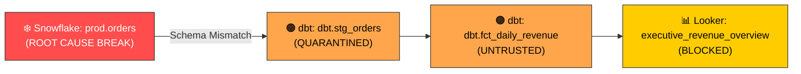

# 🚨 GraphOath Automated Incident Triage Report

**Incident ID**: `INC-2026-0810-7791`  
**Timestamp**: `2026-08-10T12:00:00Z`  
**Severity**: `CRITICAL (P1)`  
**DataHub Incident URN**: `urn:li:incident:inc-2026-0810-7791`  
**Evaluation Latency**: `1.42 ms`  

---

## 📌 Executive Summary

At 12:00:00 UTC, an upstream schema alteration was detected in Snowflake dataset `prod.orders` (`urn:li:dataset:(urn:li:dataPlatform:snowflake,prod.orders,PROD)`). The column `customer_id` was renamed to `user_uuid` without a downstream transformation update in dbt.

GraphOath's Citation Gate intercepted the dbt pipeline DAG run, identified 3 downstream assets impacted by the breaking schema change, quarantined the dbt model `dbt.stg_orders`, and tagged all affected DataHub assets as `UNTRUSTED`.

---

## 🗺️ Downstream Blast Radius & Lineage Graph



### Impacted Entities Detail Table

| DataHub URN | Platform | Asset Name | Status | Revenue At Risk | Technical Owner |
| :--- | :--- | :--- | :--- | :--- | :--- |
| `urn:li:dataset:(snowflake,prod.orders,PROD)` | Snowflake | `prod.orders` | `ROOT CAUSE FAIL` | $142,500 / hr | `priya_ramaswamy` |
| `urn:li:dataset:(dbt,dbt.stg_orders,PROD)` | dbt | `dbt.stg_orders` | `QUARANTINED` | $142,500 / hr | `data_eng_team` |
| `urn:li:dataset:(dbt,dbt.fct_daily_revenue,PROD)` | dbt | `dbt.fct_daily_revenue` | `UNTRUSTED` | $142,500 / hr | `finance_analytics` |
| `urn:li:chart:(looker,executive_revenue_overview,PROD)` | Looker | `executive_revenue_overview` | `BLOCKED` | N/A (Executive UI) | `bi_team` |

---

## 🛡️ GraphOath Automated Remediation Executed

1. **Citation Gate Interception**:
   - Status: `REJECTED (422)`
   - Reason: `Schema mismatch on field 'customer_id' required by downstream dbt.stg_orders`
2. **DataHub Incident Creation**:
   - Created native DataHub Incident ticket: `urn:li:incident:inc-2026-0810-7791` via GMS GraphQL API.
3. **TrustTag Application**:
   - Applied aspect `globalTags` with `urn:li:tag:UNTRUSTED` to all 4 entities in DataHub metadata graph.
4. **Automated Notification**:
   - Dispatched real-time alert payload to Slack channel `#data-ops-incidents` and Webhook operator subscriber.

---

## 🔐 Cryptographic Verification Proof

```json
{
  "receipt_id": "rcpt_98fa201b-5e32-4781-a901-71e8c187f54c",
  "merkle_index": 1042,
  "previous_hash": "e3b0c44298fc1c149afbf4c8996fb92427ae41e4649b934ca495991b7852b855",
  "current_hash": "a823b49191d8e12f00492c10b779a1f280a91176b51829e19c0b11a9128f7a62",
  "verification_status": "VALID",
  "timestamp": "2026-08-10T12:00:00.142Z"
}
```
